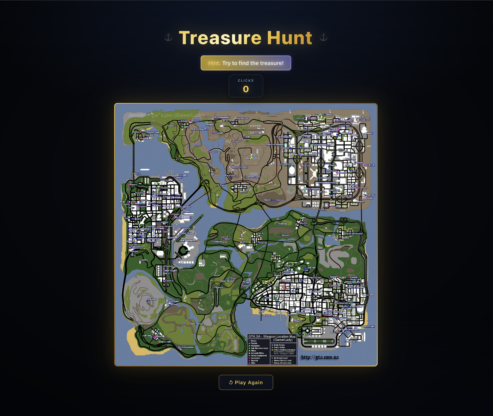

# 🏴‍☠️ Treasure Hunt

A professionally engineered, interactive "Hot or Cold" treasure hunting game. This project demonstrates a full-cycle frontend development approach, emphasizing **type safety, architectural scalability, and automated quality assurance**.



## 🚀 Engineering Excellence

Beyond the game mechanics, this project serves as a showcase of modern software engineering practices:

### 🛠️ Technical Implementation

- **Type-Safe Architecture**: Fully migrated to **TypeScript**, ensuring robust data structures and reducing runtime errors through strict typing of game state and event handlers.
- **Separation of Concerns**: Decoupled game logic from the UI by implementing a **custom React hook (`useTreasureHunt`)** and a layer of **pure utility functions**. This ensures the business logic is independent of the presentation layer.
- **TDD (Test-Driven Development)**:
  - **Unit Testing**: Comprehensive suite using **Vitest** and **React Testing Library** to verify proximity algorithms and state transitions.
  - **E2E Testing**: Implemented **Playwright** to simulate real user journeys, ensuring the critical "Happy Path" (loading $\rightarrow$ searching $\rightarrow$ winning) is always functional.
- **Automated CI/CD Pipeline**: Integrated **GitHub Actions** to run linting and the full test suite on every push, preventing regressions and ensuring production-ready code.

## 🌟 Features

- **Dynamic Proximity System**: Real-time distance calculation using Euclidean geometry:
  - ❄️ **Cold**: Far from the treasure.
  - 🌡️ **Warm**: Getting closer.
  - 🔥 **Very Hot**: Almost there!
  - 🎉 **Found**: Treasure discovered!
- **GTA-Style Rewards**: High-energy "Mission Passed" animation with the iconic Pricedown font and sound effects.
- **Score Tracking**: Persistent high-score tracking using `localStorage`.
- **Responsive Design**: Fully optimized for desktop and mobile devices using Tailwind CSS.
- **Performance Optimized**: Custom loading lifecycle to ensure map assets are fully rendered before gameplay begins.

## 🛠️ Tech Stack

| Layer          | Technology                                |
| :------------- | :---------------------------------------- |
| **Language**   | TypeScript                                |
| **Framework**  | React 19                                  |
| **Build Tool** | Vite                                      |
| **Styling**    | Tailwind CSS & SCSS                       |
| **Testing**    | Vitest, React Testing Library, Playwright |
| **CI/CD**      | GitHub Actions $\rightarrow$ Vercel       |

## 🚀 Getting Started

### Installation

1. Clone the repository:
   ```bash
   git clone https://github.com/itosya/treasure-hunt.git
   ```
2. Install dependencies:
   ```bash
   npm install
   ```
3. Start the development server:
   ```bash
   npm run dev
   ```

### Running Tests

- **Unit Tests**: `npm test`
- **E2E Tests**: `npm run test:e2e`

## 📁 Project Structure

```text
src/
├── assets/             # Map images, sound effects, and custom fonts
├── hooks/              # Custom React hooks (Game logic orchestration)
├── utils/              # Pure functions (Distance & Hint calculations)
├── App.tsx            # UI Presentation layer
├── main.tsx            # Application entry point
└── vite-env.d.ts       # TypeScript declarations for assets
tests/
└── e2e/                # Playwright end-to-end test suites
```

---

_Developed by [iTosya](https://github.com/iTosia)_
